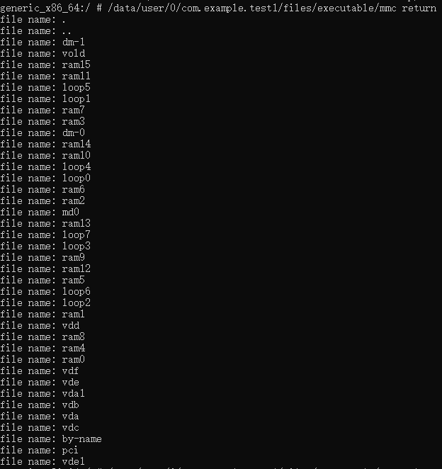
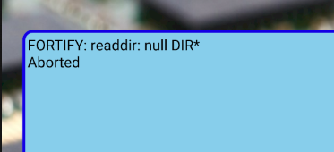
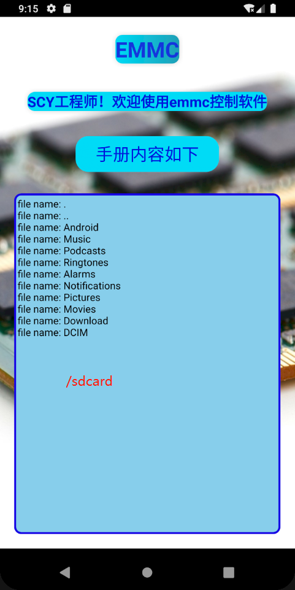

# 虚伪的成功跑通

## 何为虚伪的成功跑通

昨天，我们无论是在虚拟机上还是在真机上的烧写测试，都反馈运行的成功。  
但是，这些测试都是用adb来做的，adb经过`adb root`后其`shell`天然自带`root`权限，因此执行mmc可执行文件是没有问题。  
而当用apk来调用的时候，因为`Andorid 9`移除了`su`文件，在低版本能成功运行的`su`在`Andorid 9`巧妇难为无米之炊。   
用具有`root`权限的`adb`可成功执行  


## 测试的依据


今天在`Andorid 9`的虚拟机上测试用c方法的`mmc`来获取`/dev/block/`的文件路径  
### /dev/block/
其获取结果如下: 用apk不能获取到`/dev/block/`d目录下的文件



### /sdcard
更改工程代码的目标目录：  
尝试不需要root权限的`/sdcard`目录
```
dir = opendir("/sdcard");
```
其结果表示可以读取到`/sdcard`目录文件  


## 结论

通过测试的结果判断，`Android 9`上`apk`并不具备权限  
在`Android 4.4` 上程序可正常执行  

## 预想下一步
还是想办法破解`Android 9`系统  