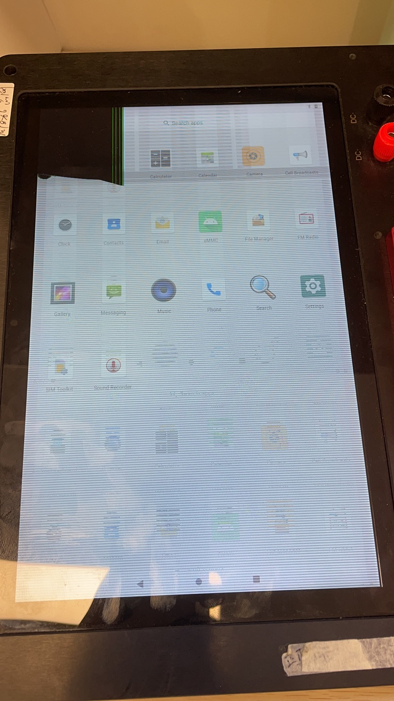
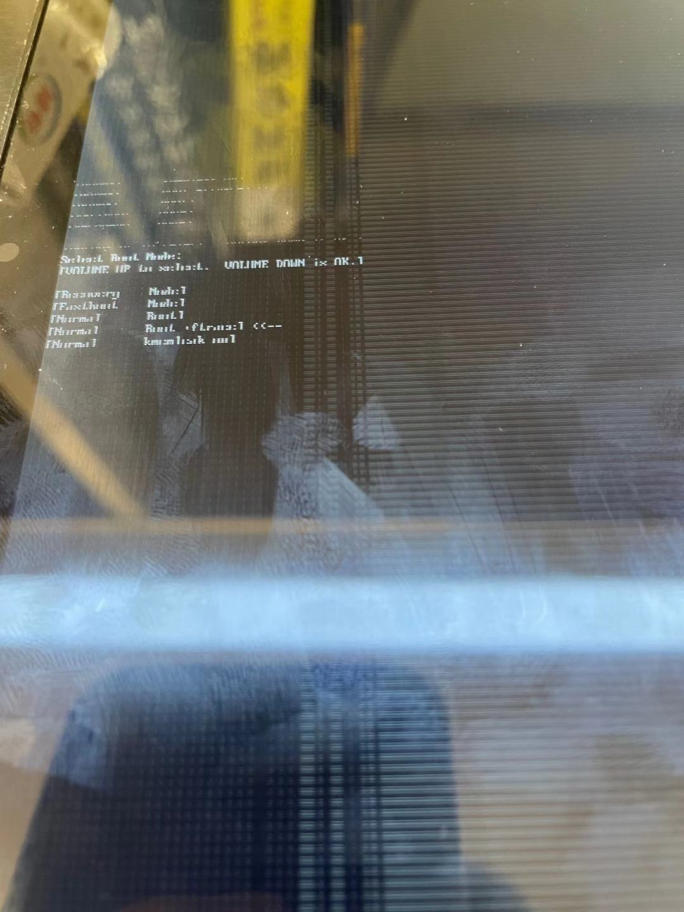
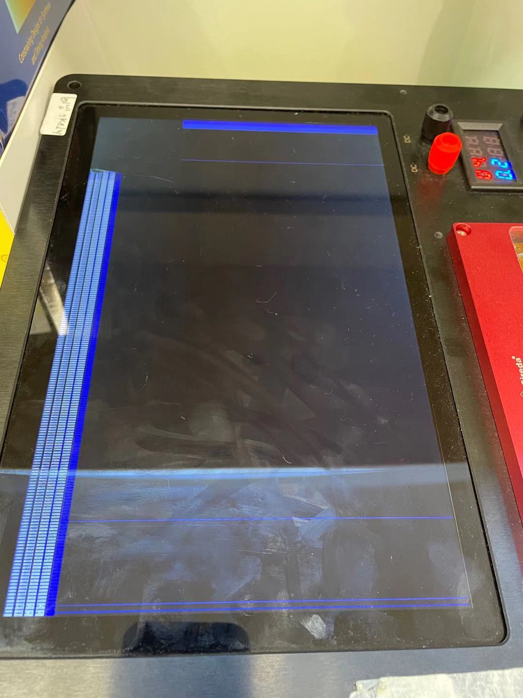

# Android 9 软件破解

## 设备



## 安装软件

在`tools`目录下按`shift`键+鼠标右键，选择`PowerShell`打开
```
adb push .\MagiskManager-v7.5.1.apk /sdcard/
adb push .\Magisk-v20.4.zip /sdcard/
```

在平板上打开`file Manager`点击.apk安装，反馈`the file former is not support`, 猜想可能是Android 9禁止未知来源的APK安装。  
于是用`adb.exe`来安装

在`tools`目录下按`shift`键+鼠标右键，选择`PowerShell`打开
```
adb install .\MagiskManager-v7.5.1.apk
```

关机后，按`关机键` + `音量+键`开机，



关机后，按`关机键` + `音量-键`开机，



并未按照视频所示进入界面，应该是厂商间的差异。