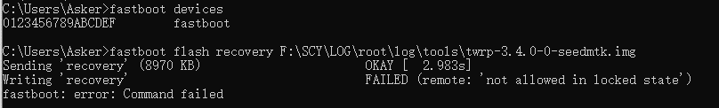
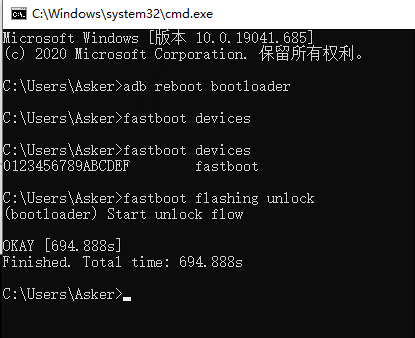
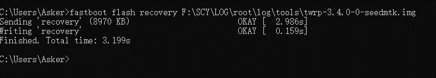

# Android 9 刷机 - Magisk Manager

## 引导加载程序
命令：重新启动进入引导加载程序
```
adb reboot bootloader
```

```
fastboot boot 
```

## < waiting for any device > 问题
驱动原因：在设备管理器中选择设备，更新驱动程序->浏览我的电脑以查找驱动程序->让我从计算机上的可用驱动程序列表中选取(L)->选择`Android Bootloader Interface`

## OEM 解锁
在`Android`开发者工具中打开`oem`功能。  
  
刷入过程可能出现如上图所示，为并没打开`oem`。  

#### 通过命令 `fastboot oem lks` 查看`oem`是否打开  
`lks = 0` 则表示已经打开，否则为未打开。

#### 若`lks = 1` 仍未解锁
重新启动进入引导加载程序，然后使用`fastboot`解锁。
* 对于新款设备（2015年及以后发布的设备）  
`fastboot flashing unlock`
* 对于老款设备（2015年及之前发布的设备）  
`fastboot oem unlock`

查看`lks = 0`表示`oem`已经打开  
```
C:\Users\Asker> fastboot oem lks
(bootloader) lks = 0
OKAY [ 0.012s]
Finished. Total time: 0.013s
```

## 记录



