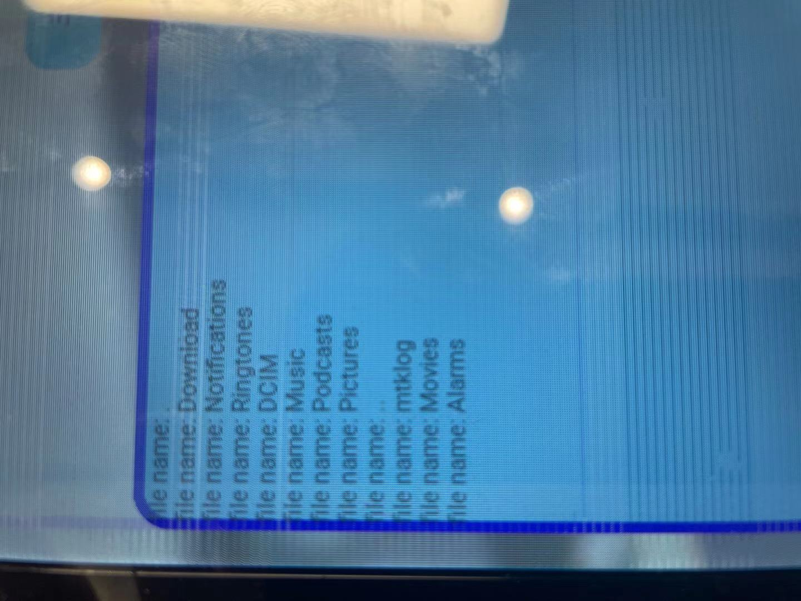
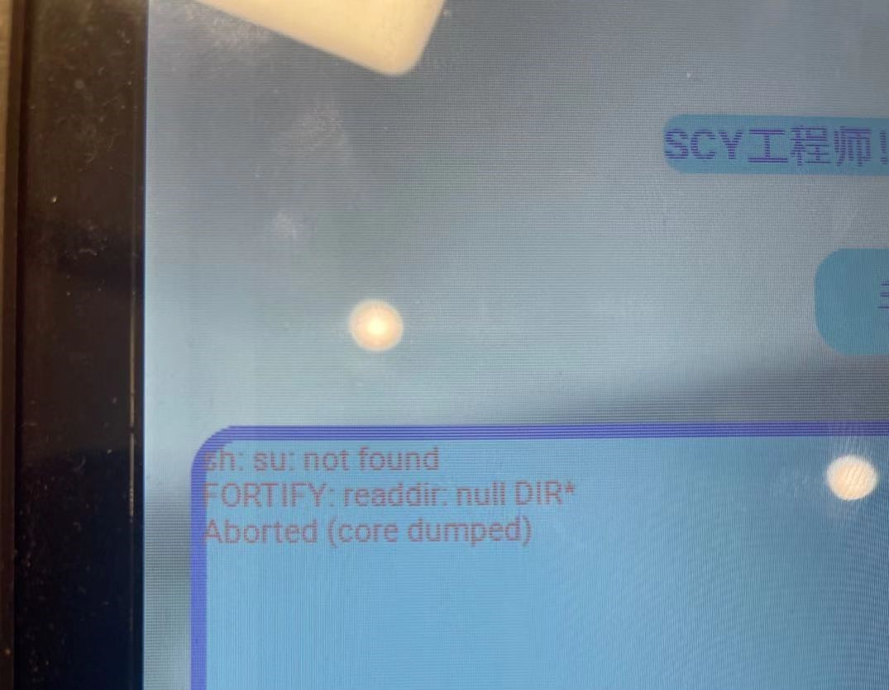
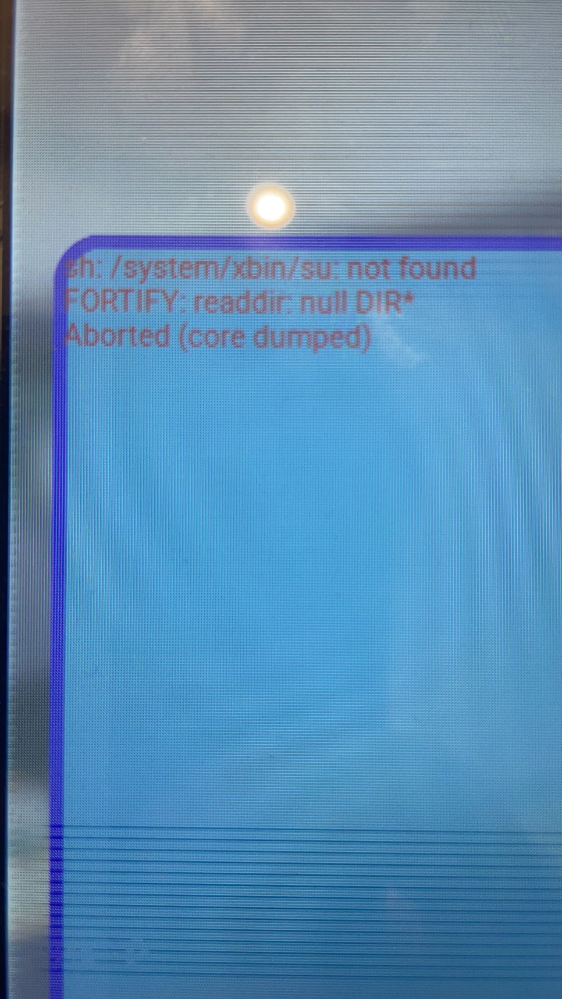

# SCY apk c端执行system("su")实验结果

## su 位置
su执行文件在`/system/xbin/su`目录下

## 前言: JAVA 上执行方式
Runtime.getRuntime()返回当前应用程序的Runtime对象，该对象的exec()方法指示Java虚拟机(JVM)创建一个子进程执行指定的可执行程序，并返回与该子进程对应的Process对象实例。通过Process可以控制该子进程的执行或获取该子进程的信息。通过Process的getInputStream()，getOutputStream()和getErrorStream()方法可以得到输入输出流，然后通过InputStream可以得到程序对控制台的输出信息，通过OutputStream可以给程序输入指令,这样就达到了程序的交换功能。
* 在java上通过Process来执行`/system/xbin/su`
```
Process p = Runtime.getRuntime().exec("/system/xbin/su");   
```
`Logcat` 反馈  
```
W/System.err: java.io.IOException: Cannot run program "/system/xbin/su": error=13, Permission denied
```
* 将上一步中的`/system/xbin/su`替换为`su`
```
W/System.err: java.io.IOException: Cannot run program "su": error=13, Permission denied
```


## C 执行 su 的准备工作
* 为了防止在上面`JAVA`执行`su`就因为`Permission denied`报错终止,造成并未执行到`mmc`可执行程序的情况，作如下修改：
```
Process p = Runtime.getRuntime().exec("sh");
```  
此时运行程序，查看设备    
  
  
`return`命令是暂时是输出`/dev/block`下所有文件信息，先测试其功能，由上图可以看到输出信息，转换为下列文字:   
执行`return`的反馈
```
FORTIFY:readdir:null DIR*
Aborted(core dumped)
```
执行`extcsd read`的反馈
```
read extcsd begin!
open: No such file or directory
```
那么，对比的来实验，我们把`return`命令的输出路径`/dev/block`修改为`/sdcard`   
   

> 上述对比在`12-14-Android 9 的权限问题暴露.md`中有相关提及。  

+ 可以看到有目录输出，猜想是权限受阻  
+ 但这些工作也是用来验证在`java`上执行`sh`可以打开终端输出流，不会在此步因为权限禁止而终止运行，可以继续执行`mmc`可执行程序，输出反馈信息并打印到`apk`的`UI`上。  

## 在 C 上开始实验
* 首先在`mmc.elf`的`main`入口上执行`system("su")` :
```
int main(int ac, char **av )
{
    char		*cmd=0, **args=0;
    int		nargs=0, r;
    CommandFunction func=0;

    system("su");

    r = parse_args(ac, av, &func, &nargs, &cmd, &args);
    if( r <= 0 ){
        /* error or no command to parse*/
        exit(-r);
    }

    exit(func(nargs, args));
}
```
在设备上运行，点击`button`执行`return`命令
  
```
sh: su: not found
FORTIFY:readdir:null DIR*
Aborted(core dumped)
```
* 再修改上述system
```
system("/system/xbin/su");
```
  
```
sh: /system/xbin/su: not found
FORTIFY:readdir:null DIR*
Aborted(core dumped)
```

# 初步结论
* 简单验证在`mmc`的可执行程序上以`system`执行`su`失败。