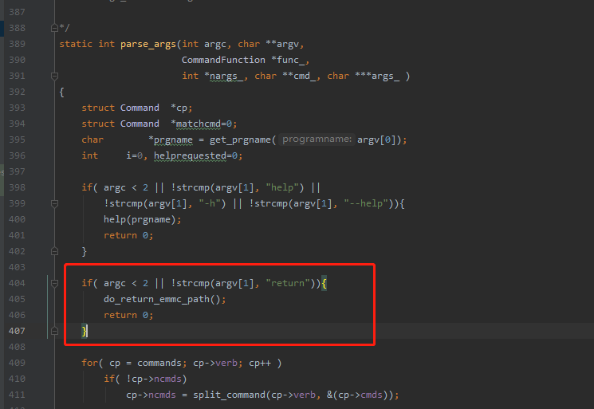

# Android eMMC 设备路径获取设想

### apk启动时
apk启动时，需要获取到可读eMMC设备的路径


## c里添加执行函数
在`mmc_cmds.c`最后添加输出eMMC设备的函数

```
int do_return_emmc_path()
{
    DIR *dir;
    struct    dirent    *ptr;

    dir = opendir("/dev/block/");   // 指定搜索的目录
    while((ptr = readdir(dir)) != NULL) {
        // 判断eMMC芯片, 可加入正则表达式匹配
        // 这一步是直接采用mmc源码内置的do_read_extcsd()来检测
        if(do_read_extcsd(2, ptr->d_name))
            printf("file name: %s\n", ptr->d_name);
    }

    closedir(dir);
    return 0;
}
```

## `mmc.c`内设置执行上述函数的调用参数
当命令`./mmc` 的参数为`return`时执行上面的遍历文件的函数  
下列函数加在`mmc.c`内的`parse_args()`函数类
```
// 判断参数是否小于2，并且参数是否匹配"return"
if( argc < 2 || !strcmp(argv[1], "return"))
{
        do_return_emmc_path();
        return 0;
}
```
这样用`./mmc return`命令就会执行上述函数  



## `CopyElfs.java`里添加读取eMMC设备路径的方法  
此方法相比之前调用mmc，仅仅只多了返回类型`List<String>`
```
// CopyElfs.java 添加读取eMMC设备路径的方法，以List<String>类型返回
public List<String> return_path(String cmd) throws InterruptedException {
        List<String> emmc_path = null;
        String tmpText;
        DataOutputStream dos = null;
        BufferedReader br = null;
        BufferedReader err = null;
        try {
            Process p = Runtime.getRuntime().exec(rootcmd);// 获取root
            dos = new DataOutputStream(p.getOutputStream());// 写入流
            br = new BufferedReader(new InputStreamReader(p.getInputStream()));// 输出缓存
            err = new BufferedReader(new InputStreamReader(p.getErrorStream()));// 错误流缓存

            dos.writeBytes(cmd + "\n");
            dos.flush();
            dos.writeBytes("exit\n");
            dos.flush();

            while ((tmpText = br.readLine()) != null) {
                tmpText += "\n";
                emmc_path.add(tmpText);
            }
            while ((tmpText = err.readLine()) != null) {
                return null;
            }

            // 等待shell子进程执行完成,返回0表示正常结束
            p.waitFor();
        }catch (IOException e){
            e.printStackTrace();
        }
        finally {
            if (dos != null) {
                try {
                    dos.close();
                } catch (IOException e) {
                    e.printStackTrace();
                }
            }
            if (br != null) {
                try {
                    br.close();
                } catch (IOException e) {
                    e.printStackTrace();
                }
            }
            if (err != null) {
                try {
                    err.close();
                } catch (IOException e) {
                    e.printStackTrace();
                }
            }
        }
        return emmc_path;
    }
```


## 在apk的初始化中添加
apk在启动时，会进入到`onCreate()`方法，在此方法内调用新增的`mmc return`命令来获取device path
```
private CopyElfs ce;    // 声明获取mmc可执行文件路径的类
private List<String> pathlist;

protected void onCreate(Bundle savedInstanceState) {
    super.onCreate(savedInstanceState);

    ce = new CopyElfs(getBaseContext(), null); // 这一步的第二个参数不需要handler
    ce.copyAll2Data();
    String get_path_cmd = ce.getExecutableFilePath() + "/mmc return";
    pathlist = ce.return_path(get_path_cmd); // 传入···/mmc return命令并执行

}
```

## 通过下拉列表来显示路径
用获取到的`List<string>`来实现  
······